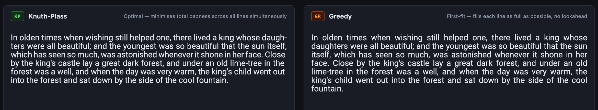
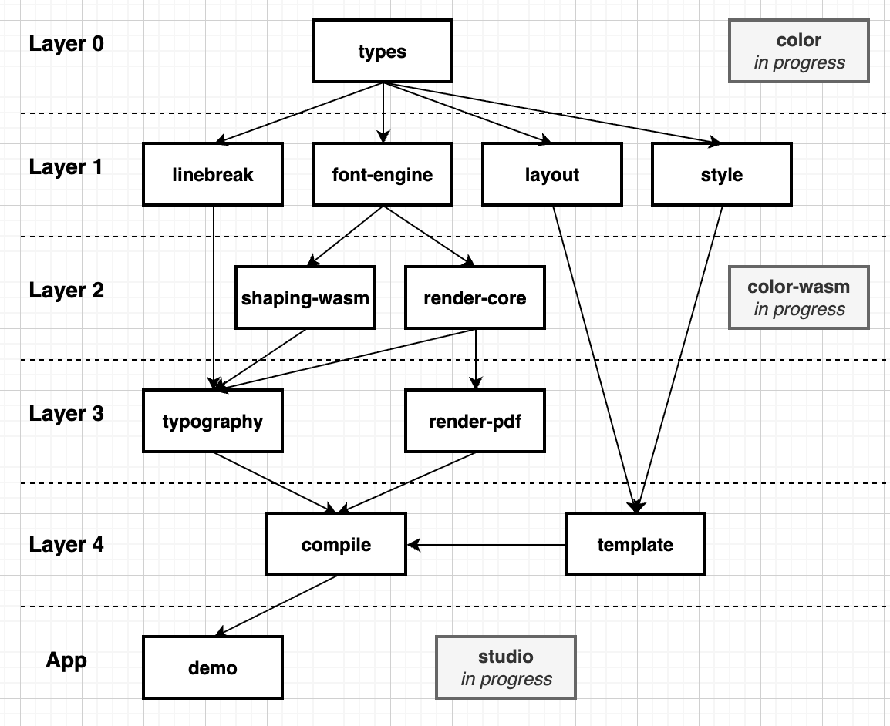

# paragraf

[](https://github.com/kadetr/paragraf/actions/workflows/ci.yml)

**Publication-quality typesetting in JavaScript.** Knuth-Plass optimal line breaking, OpenType shaping via Rust/WASM, 22-language hyphenation, Unicode BiDi, optical margin alignment, and multi-frame document composition — outputting SVG, Canvas, or PDF.

**[→ Live demo](https://kadetr.github.io/paragraf/)**

---

## Why paragraf

Every JavaScript text renderer uses a greedy algorithm: pack words left-to-right until the line is full, then move on. It's fast and simple, but it produces uneven spacing — some lines tight, others loose — and it can't trade a slightly worse line now for a much better paragraph later.

**Knuth-Plass** (the algorithm behind TeX) solves the entire paragraph at once, minimising total inter-word space deviation across all lines simultaneously. The difference is visible at a glance:



paragraf is the only JavaScript library that does this with real font metrics — not character-count estimates or canvas measurement hacks, but a full OpenType shaper (rustybuzz, compiled to WASM) that produces the same glyph advances a PDF print engine would use.

---

## What nothing else in JS does

| Feature | paragraf | tex-linebreak | pdfmake | jsPDF |
|---|:---:|:---:|:---:|:---:|
| Knuth-Plass line breaking | ✅ | ✅ | — | — |
| OpenType shaping (GSUB/GPOS) | ✅ | — | — | — |
| Real glyph metrics via Rust/WASM | ✅ | — | — | — |
| 22-language hyphenation | ✅ | partial | — | — |
| Unicode BiDi (Arabic, Hebrew) | ✅ | — | — | — |
| Optical margin alignment | ✅ | — | — | — |
| Multi-frame / multi-column layout | ✅ | — | ✅ | — |
| SVG + Canvas + PDF output | ✅ | — | PDF | PDF |
| Browser + Node | ✅ | ✅ | ✅ | ✅ |

---

## Packages

| Folder | Package | Description | Browser |
|---|---|---|:---:|
| 0-types/ | `@paragraf/types` | Zero-dep Shared Interfaces<br/>`Font`, `ComposedLine`, `FontRegistry`, … | ✅ |
| 1a-linebreak/ | `@paragraf/linebreak` | Knuth-Plass Algorithm<br/>+20-Language Hyphenation<br/>Node Builder, Traceback | ✅ |
| 1b-font-engine/ | `@paragraf/font-engine` | Fontkit Adapter, Measurer Factory<br/>`FontEngine` Interface, Fontkit Implementation | ✅ |
| 2a-shaping-wasm/ | `@paragraf/shaping-wasm` | Rust/WASM OpenType Shaper (rustybuzz)<br/>HarfBuzz-Grade Shaping<br/>GSUB Ligatures, GPOS Kerning, sups/subs | Node |
| 2b-render-core/ | `@paragraf/render-core` | Layout → SVG / Canvas<br/>`layoutParagraph` → `renderToSvg`/`renderToCanvas` | ✅ |
| 3a-typography/ | `@paragraf/typography` | Compositor + Document Model<br>High-Level Compositor, OMA, BiDi | Node |
| 3b-render-pdf/ | `@paragraf/render-pdf` | PDF Output<br/>`renderToPdf` via Pdfkit | Node |

---

## Architecture

Packages are organised in strict layers — each package only imports from layers below it.



**Dependency facts (from `package.json`):**
- `linebreak` → `types`
- `font-engine` → `types`
- `shaping-wasm` → `types` + `font-engine`
- `render-core` → `types` + `font-engine`
- `typography` → `types`, `linebreak`, `font-engine`, `shaping-wasm`, `render-core`
- `render-pdf` → `types`, `font-engine`, `render-core` &nbsp;(no mandatory `typography` dependency)
- `render-pdf` → all packages &nbsp;(for full path)


---

## Quick start

```bash
npm install @paragraf/typography @paragraf/render-pdf
```

`@paragraf/types`, `@paragraf/linebreak`, `@paragraf/font-engine`, `@paragraf/render-core`, and `@paragraf/shaping-wasm` (including the prebuilt WASM binary) are all declared as direct dependencies of `@paragraf/typography` and are installed automatically.

```ts
import { createParagraphComposer, createDefaultFontEngine } from '@paragraf/typography';
import { createMeasurer }    from '@paragraf/font-engine';
import { layoutParagraph }   from '@paragraf/render-core';
import { renderToPdf }       from '@paragraf/render-pdf';
import { createWriteStream } from 'fs';

// 1. Register fonts
const registry = new Map([
  ['body', { id: 'body', face: 'SourceSerif4', filePath: './fonts/SourceSerif4-Regular.ttf' }],
]);

// 2. Compose — finds optimal line breaks for the whole paragraph at once
const composer = await createParagraphComposer(registry);
const { lines } = composer.compose({
  text: 'In olden times when wishing still helped one, there lived a king whose daughters were all beautiful.',
  font: { id: 'body', size: 11, weight: 400, style: 'normal', stretch: 'normal' },
  lineWidth: 396,   // points (1pt = 1/72 inch)
  tolerance: 2,
  alignment: 'justified',
  language: 'en-us',
});

// 3. Layout — positions every glyph on the page
const measurer = createMeasurer(registry);
const rendered = layoutParagraph(lines, measurer, { x: 72, y: 72 });

// 4. Render to PDF
const engine = await createDefaultFontEngine(registry);
await renderToPdf(rendered, engine, registry, createWriteStream('output.pdf'));
```

**Browser (SVG output, WASM shaper):**

```ts
import { BrowserWasmFontEngine } from '@paragraf/shaping-wasm/browser';
import { layoutParagraph, renderToSvg } from '@paragraf/render-core';
import { composeKP } from './your-compose-pipeline';

const engine = new BrowserWasmFontEngine();
const fontBytes = await fetch('/fonts/Roboto-Regular.ttf').then(r => r.arrayBuffer());
engine.loadFontBytes('roboto', new Uint8Array(fontBytes));

const composed = composeKP(text, font, lineWidth, registry);
const rendered = layoutParagraph(composed, measurer, { x: 0, y: 0 });
const height   = composed.reduce((s, l) => s + l.lineHeight, 0);
document.getElementById('output').innerHTML = renderToSvg(rendered, engine, { width: lineWidth, height });
```

---

## Development

```bash
npm install        # install all workspace dependencies
npm test           # 483 tests across all packages
npm run build      # build all packages to dist/
```

The WASM shaper ships as a prebuilt binary (`2a-shaping-wasm/wasm/pkg/`). The Rust source is not included in this repository. To rebuild after modifying the Rust layer:

```bash
cd 2a-shaping-wasm/wasm
wasm-pack build --target nodejs   # Node
wasm-pack build --target bundler --out-dir pkg-bundler --release  # Browser (Vite)
```

`@paragraf/typography` auto-detects the WASM shaper at module init and falls back to the pure TypeScript fontkit path silently if WASM is absent. Use `wasmStatus()` to inspect which path is active.

---

## Status

**v0.3.0 — pre-release.** The core algorithm and rendering pipeline are stable and well-tested. APIs may change before 1.0. Not yet published to npm.

See [`docs/`](docs/) for architecture details, IO schemas, and the document model reference.
